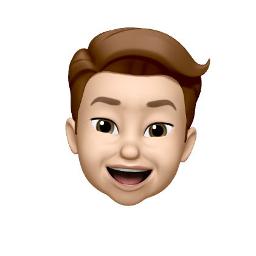

<p align="center">
  <a href="https://github.com/tomasson82/tommys-thoughts">
    
  </a>
</p>
<h1 align="center">
  Tommy's thoughts
</h1>

My [personal blog](https://tommys-thoughts.tomasson82.now.sh/). Build with [Gatsby's blog starter](https://www.gatsbyjs.org/starters/gatsbyjs/gatsby-starter-blog/) and [theme-ui gatsby-plugin](https://theme-ui.com/packages/gatsby-plugin).

To check the deployed version click this [link](https://tommys-thoughts.tomasson82.now.sh/).

## 🚀 Quick start to run locally

1.  **Checkout this repository.**

1.  **Start developing.**

    Navigate into your directory and start it up.

    ```shell
    cd tommy-thoughts/
    gatsby develop
    ```

1.  **Open the source code and start editing!**

    Your site is now running at `http://localhost:8000`!

    _Note: For further information check the [Gatsby-Docs](https://www.gatsbyjs.org/docs/) or the [github repo](https://github.com/gatsbyjs/gatsby-starter-blog)._

## 🧐 What's inside?

For now this is a learning playground and some kind of second brain 🧠.

## 💫 Deploy

[](https://vercel.com/import/project?template=https://github.com/gatsbyjs/gatsby-starter-blog)

## 🏗 Created with Gatsby

<a href="https://www.gatsbyjs.org">
  
</a>
  
For this website the [Gatsby's blog starter](https://www.gatsbyjs.org/starters/gatsbyjs/gatsby-starter-blog/) was used!

Thanks a lot to [Gatsbyjs](https://www.gatsbyjs.org/) ✌️

Check the [Demo](https://gatsby-starter-blog-demo.netlify.app/) or [Github](https://github.com/gatsbyjs/gatsby-starter-blog).
